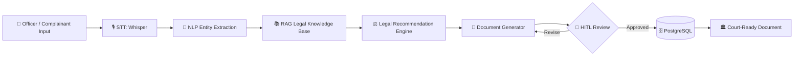

<div align="center">

# 🛡️ VIDURA
### AI-Powered Investigation & Legal Documentation Assistant

**Turning the first hour of an investigation into the most productive one.**

*Built by Team **MuleShield AI***

<br/>

[](./LICENSE)
[](#)
[](#)
[](#)
[](#)
[](#)
[](#)
[](#)
[](#)
[](./CONTRIBUTING.md)
[](./CODE_OF_CONDUCT.md)

</div>

---

> ⚠️ **Disclaimer:** VIDURA is an academic / hackathon prototype intended to demonstrate an AI-assisted documentation workflow for law enforcement. It is **not** an officially adopted government system and must undergo formal security, legal, and procedural certification before any real-world deployment.

---

## 📖 Table of Contents

- [🎯 Problem Statement](#-problem-statement)
- [💡 Our Solution](#-our-solution)
- [✨ Key Features](#-key-features)
- [🏗️ System Overview](#️-system-overview)
- [🧰 Tech Stack](#-tech-stack)
- [🚀 Quick Start](#-quick-start)
- [📁 Repository Structure](#-repository-structure)
- [📚 Documentation](#-documentation)
- [🗺️ Roadmap](#️-roadmap)
- [🤝 Contributing](#-contributing)
- [🔐 Security](#-security)
- [📄 License](#-license)
- [👥 Team](#-team)

---

## 🎯 Problem Statement

Frontline investigating officers spend a disproportionate share of their working hours on **manual, repetitive documentation** — First Information Reports (FIRs), Case Diaries, and Charge Sheets — rather than active investigation.

This process today is:

- 📝 **Manual** — hand-typed or dictated, section-by-section
- ⚠️ **Error-Prone** — inconsistent formatting, missed legal sections, human transcription errors
- 🧩 **Fragmented** — evidence, statements, and legal references live in disconnected systems
- ⏱️ **Time-Consuming** — hours spent per case on paperwork that delays case progression and court readiness

## 💡 Our Solution

**VIDURA** ("the wise counsel") is an **AI Investigation Copilot** that listens, understands, and drafts.

It converts raw **voice or text complaints** into **court-ready, legally-mapped documents** — while keeping a human investigating officer firmly in control through a **Human-in-the-Loop (HITL)** approval layer at every stage.

```
🎙️ Voice/Text Complaint → 📝 Speech-to-Text → 🧠 NLP Entity Extraction 
   → 📚 RAG Legal Knowledge Base → ⚖️ AI Legal Recommendation Engine 
      → 📄 Document Generator → 👮 Officer Review (HITL) 
         → 🗄️ Secure PostgreSQL Storage → 🏛️ Court-Ready Documents
```

---

## ✨ Key Features

| Feature | Description |
|---|---|
| 🎙️ **Speech-to-Text Intake** | Whisper-based transcription of voice complaints in real time |
| 🧠 **NLP Entity Extraction** | Automatic identification of persons, locations, dates, weapons, and incident details |
| 📚 **Legal RAG Engine** | Retrieval-Augmented Generation over a curated **BNS / BNSS / BSA** legal knowledge base |
| ⚖️ **AI Legal Recommendation** | Suggests applicable penal code sections with supporting legal rationale |
| 📄 **Automated Document Drafting** | Auto-generates FIRs, Case Diaries, and Charge Sheets in standardized formats |
| ✅ **Human-in-the-Loop (HITL)** | Every AI-generated section requires explicit officer review and sign-off before it becomes part of the official record |
| 🔐 **Enterprise-Grade Security** | AES-256 encryption, JWT authentication, Role-Based Access Control, TLS in transit |
| 🧾 **Immutable Audit Logs** | Tamper-evident logging of every action for legal admissibility and accountability |
| ☁️ **Cloud-Native Microservices** | Independently scalable services deployed on GCP via Docker/Kubernetes |
| 🌐 **Multilingual-Ready Architecture** | Designed to extend to regional languages in future releases |

---

## 🏗️ System Overview

VIDURA is composed of independently deployable microservices spanning the **frontend console**, **core backend**, and **AI engine**. See [`docs/ARCHITECTURE.md`](./docs/ARCHITECTURE.md) for the full system diagram and data flow.



---

## 🧰 Tech Stack

<div align="center">

| Layer | Technologies |
|---|---|
| **Frontend** | React.js, TypeScript |
| **Backend** | FastAPI (Python), REST/gRPC microservices |
| **Database** | PostgreSQL (relational), Vector Store (semantic search) |
| **AI Pipeline** | OpenAI Whisper (STT), spaCy/Transformer-based NER, RAG, LLMs |
| **Cloud & DevOps** | Google Cloud Platform (GCP), Docker, Kubernetes (GKE), Terraform |
| **Security** | AES-256, JWT, OAuth2/RBAC, TLS 1.3, Immutable Audit Trails |

</div>

---

## 🚀 Quick Start

### Prerequisites

- Docker & Docker Compose ≥ 24.x
- Node.js ≥ 18.x (frontend development)
- Python ≥ 3.11 (backend/AI development)
- PostgreSQL ≥ 15 (or use the bundled container)
- A GCP account (optional, for cloud deployment)

### 1️⃣ Clone the Repository

```bash
git clone https://github.com/MuleShield-AI/VIDURA.git
cd VIDURA
```

### 2️⃣ Configure Environment Variables

```bash
cp .env.example .env
# Populate secrets: DB credentials, JWT secret, Whisper/LLM API keys
```

### 3️⃣ Launch with Docker Compose

```bash
docker-compose -f infra/docker-compose.yml up --build
```

This spins up:
- `frontend` — React console on `http://localhost:3000`
- `gateway-service` — API Gateway on `http://localhost:8000`
- `auth-service`, `case-service`, `audit-service`
- `stt-service`, `nlp-service`, `rag-service`, `legal-recommendation-engine`, `document-generator`
- `postgres` — Relational database
- `vector-db` — Semantic legal knowledge store

### 4️⃣ Seed the Legal Knowledge Base

```bash
python scripts/seed_legal_corpus.py
```

### 5️⃣ Access the Application

Navigate to `http://localhost:3000` and log in with the seeded demo officer credentials in `.env.example`.

---

## 📁 Repository Structure

Full directory blueprint available in [`PROJECT_STRUCTURE.md`](./PROJECT_STRUCTURE.md).

## 📚 Documentation

| Document | Description |
|---|---|
| [`docs/ARCHITECTURE.md`](./docs/ARCHITECTURE.md) | Microservices architecture, AI pipeline, and security mechanisms |
| [`docs/WORKFLOW.md`](./docs/WORKFLOW.md) | End-to-end operational workflow with sequence diagram |
| [`docs/DATABASE.md`](./docs/DATABASE.md) | Relational + vector database schema and ER diagram |
| [`docs/SECURITY.md`](./docs/SECURITY.md) | Encryption, authentication, RBAC, and audit logging design |
| [`docs/ROADMAP.md`](./docs/ROADMAP.md) | Scalability strategy and future feature roadmap |

## 🗺️ Roadmap

A condensed preview — full detail in [`docs/ROADMAP.md`](./docs/ROADMAP.md):

- [ ] 🌐 Multilingual voice intake (Hindi, Tamil, Bengali, and more)
- [ ] 🎥 Video/CCTV evidence analysis module
- [ ] 🔗 CCTNS (Crime and Criminal Tracking Network & Systems) integration
- [ ] 🏢 State and national-level horizontal scaling
- [ ] 📱 Offline-first mobile companion app for field officers

## 🤝 Contributing

We welcome contributions from developers, legal-tech researchers, and domain experts. Please read [`CONTRIBUTING.md`](./CONTRIBUTING.md) before submitting a Pull Request.

> 💬 **Have an idea or found a bug?** Open an [issue](../../issues) — every contribution, however small, moves this project forward.

## 🔐 Security

Please review our [Security Policy](./SECURITY.md) for responsible vulnerability disclosure. Do **not** open public issues for security vulnerabilities.

## 📄 License

This project is licensed under the **MIT License** — see [`LICENSE`](./LICENSE) for details.

## 👥 Team

**UNKNOWN CREATORS** —  Cybersecurity Capstone Project

<div align="center">

*Built with ⚖️ for smarter, faster, and more accountable policing.*

</div>
